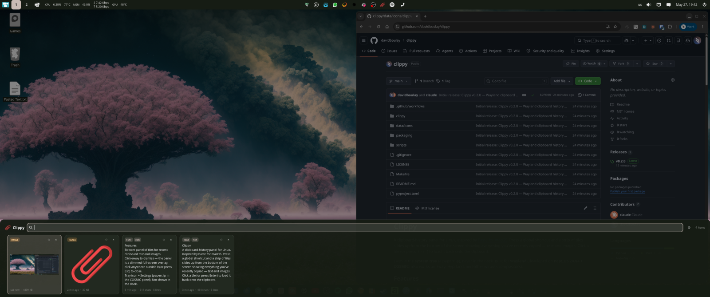

# Clippy

A clipboard-history panel for Linux, inspired by [Paste for macOS](https://pasteapp.io/).
Press a global shortcut and a strip of tiles slides up from the bottom of the
screen showing everything you've recently copied — text and images. Click a
tile (or press <kbd>Enter</kbd>) to load it back onto the clipboard.

Lives in the **system tray** (a paperclip), never in the dock. Built for
**Wayland** (developed on **Pop!_OS 24.04 + COSMIC**; also works on Sway,
Hyprland, and other wlroots compositors).



## Features

- **Bottom panel of tiles** for recent clipboard text and images.
- **Click-away to dismiss** — the panel is a dimmed full-screen overlay; click
  anywhere outside it (or press <kbd>Esc</kbd>) to close.
- **Tray icon + Settings** (paperclip in the COSMIC panel). Not shown in the dock.
- **Follows the COSMIC light/dark theme** automatically.
- **Settings**:
  - **Open at login** toggle.
  - **Sound on copy** — a short synthesized tone when you copy.
  - **Always paste as plain text** — strip formatting on paste; when off, rich
    formatting is preserved if the original had it.
  - **History retention** — keep for *1 day / 1 week / 1 month / 1 year /
    forever*, with automatic deletion past the threshold.
  - **Shortcut picker** — press a key combo and Clippy registers it in COSMIC
    for you (with a backup of your existing shortcuts).
- **Right-click a tile** → Paste, **Copy as plain text**, Copy with formatting,
  Pin/Unpin, Delete.
- **Pin** items so they survive pruning and sort first.
- **Search** by typing.

## Why these technologies?

macOS lets an app float a window over everything and grab a global hotkey.
Wayland — by design — does not. Clippy uses the native Wayland mechanisms:

| Need | macOS | Clippy (Wayland) |
|------|-------|------------------|
| Panel pinned to the screen edge | borderless window | **wlr-layer-shell** (`gtk-layer-shell`) |
| Watch the clipboard | `NSPasteboard` | **`wl-paste --watch`** (`ext-data-control`) |
| Global hotkey | `CGEventTap` | a **COSMIC custom shortcut** running `clippy toggle` |
| Tray icon | `NSStatusItem` | **StatusNotifierItem** via Ayatana **AppIndicator** |
| Theme | system | reads COSMIC's `is_dark` and matches |
| UI | AppKit | **GTK 3** (PyGObject) |
| Storage | — | **SQLite** + image files under `~/.local/share/clippy` |

One binary, several roles:

```
clippy daemon    # tray + overlay panel + IPC server + clipboard watcher
clippy toggle    # tiny client → tells the daemon to open/close (your shortcut runs this)
clippy settings  # open the settings window
clippy _store    # internal: wl-paste runs this on every clipboard change
```

The shortcut → `toggle` → Unix socket → daemon path is what lets a global key
open the panel without any forbidden hotkey grab.

## Install

### Ubuntu / Pop!_OS / Debian — recommended

Download the latest `clippy_*.deb` from the
**[Releases page](https://github.com/davidboulay/clippy/releases/latest)**, then:

```bash
sudo apt install ./clippy_0.2.4_all.deb
```

…or fetch it from the terminal with the GitHub CLI:

```bash
gh release download --repo davidboulay/clippy --pattern '*.deb'
sudo apt install ./clippy_*.deb
```

`apt` pulls in the dependencies automatically. Then launch **Clippy** from your
app list and open **Settings** to bind a shortcut (see below).

### Other distributions

- **Arch / Manjaro:** `cd packaging/arch && makepkg -si`
- **AppImage** (experimental, any distro): `make appimage`, then run `dist/Clippy-*.AppImage`
- **Flatpak / COSMIC Store:** ❌ not viable — COSMIC withholds the privileged
  `layer-shell` and `data-control` Wayland protocols from Flatpak-sandboxed
  apps, which Clippy's panel and clipboard watching require. Details in
  [`FLATHUB.md`](FLATHUB.md).

### From source

```bash
git clone https://github.com/davidboulay/clippy.git
cd clippy
./scripts/install.sh
```

`install.sh` (asks for `sudo` once) installs the dependencies, a
`~/.local/bin/clippy` launcher and icon, enables autostart, and starts the
daemon — a paperclip should appear in your COSMIC panel. To build a `.deb`
yourself instead: `make deb`, then `sudo apt install ./dist/clippy_*.deb` (see
[`packaging/README.md`](packaging/README.md)).

Dependencies: `wl-clipboard`, `python3-gi`, `gir1.2-gtk-3.0`,
`gir1.2-gtklayershell-0.1`, `libgtk-layer-shell0`,
`gir1.2-ayatanaappindicator3-0.1`, `libayatana-appindicator3-1`, `pipewire-bin`.

### Set the shortcut

Open the tray icon → **Settings** (or the ⚙ in the panel), click the shortcut
button, and press your combo (e.g. <kbd>Super</kbd>+<kbd>V</kbd>). Clippy writes
the COSMIC binding for you. To do it manually, run `clippy setup-shortcut`.

> Tray not showing? Ensure COSMIC's **Status Area / applet** is on your panel.
> Either way, the panel's ⚙ opens Settings and the shortcut still works.

## Usage

| Key / action | Effect |
|---|---|
| type | search history |
| <kbd>←</kbd>/<kbd>→</kbd> or <kbd>↑</kbd>/<kbd>↓</kbd> | move between tiles |
| <kbd>Enter</kbd> | copy selected tile & close |
| <kbd>Ctrl</kbd>+<kbd>1…9</kbd> | copy the Nth tile & close |
| <kbd>Ctrl</kbd>+<kbd>P</kbd> | pin/unpin selected |
| <kbd>Delete</kbd> | remove selected |
| <kbd>Esc</kbd> / click away | close |
| left-click tile | copy & close (respects the plain-text setting) |
| right-click tile | menu: paste / copy-as-plain / pin / delete |
| middle-click tile | delete |

After selecting a tile, paste with <kbd>Ctrl</kbd>+<kbd>V</kbd> as usual.

### Other commands

```bash
clippy status            # is the daemon up? how many items?
clippy settings          # open settings
clippy clear [--all]     # wipe history (--all includes pinned)
clippy quit              # stop the daemon
```

## Configuration & data

Preferences: `~/.config/clippy/settings.json` (edited via the Settings window).
Fixed limits/geometry: `clippy/config.py`. Colors: `clippy/theme.py`.

Everything stays local:

- `~/.local/share/clippy/history.db` — SQLite history (text + rich html inline)
- `~/.local/share/clippy/images/` — copied images
- `~/.local/share/clippy/copy.wav` — synthesized copy sound
- `$XDG_RUNTIME_DIR/clippy.sock` — control socket (mode 0600)

Nothing leaves your machine. `./scripts/uninstall.sh --purge` removes it all.
A backup of your COSMIC shortcuts is kept at
`…/CosmicSettings.Shortcuts/v1/custom.clippy.bak` the first time Clippy edits it.

## Limitations

- **No auto-paste.** Selecting a tile sets the clipboard; you press
  <kbd>Ctrl</kbd>+<kbd>V</kbd> yourself (synthetic keystrokes on Wayland need
  `ydotool`).
- **Plain/rich** uses `text/html` for the rich case (wl-copy offers one type at
  a time); plain-only apps still get plain text via the plain-text path.
- **Multi-monitor:** the panel appears on the compositor's active output.
- Needs a compositor with `wlr-layer-shell` **and** `ext-/wlr-data-control`
  (COSMIC, Sway, Hyprland). A plain GNOME Wayland session lacks layer-shell.

## Project layout

```
clippy/
  cli.py             subcommand dispatch
  daemon.py          AppController: tray + panel + settings + IPC + retention
  panel.py           overlay panel, tiles, context menu, plain/rich paste
  settings_window.py settings UI + shortcut capture
  tray.py            AppIndicator tray icon
  capture.py         read clipboard → storage (+ sound, retention)
  clipboard.py       wl-paste / wl-copy wrappers (incl. html)
  storage.py         SQLite history (+ html column, time retention)
  settings.py        JSON preferences
  theme.py           COSMIC light/dark → generated GTK CSS
  sound.py           synthesize + play the copy sound
  setup.py           autostart + COSMIC shortcut editing
  ipc.py             Unix-socket control channel
  config.py          paths & limits
scripts/install.sh · scripts/uninstall.sh · data/icons/clippy.png
```

## License

MIT
